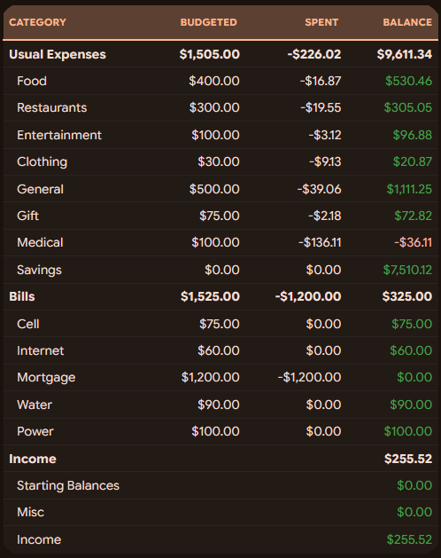
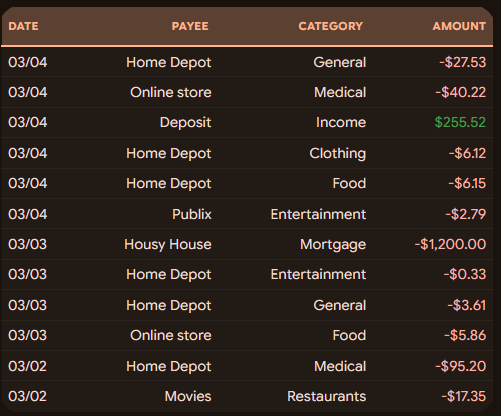

# actual-for-hass
HomeAssistant configurations to connect to Actual Budget

This repo contains a rudimentary pathway to connect HomeAssistant to Actual Budget, without the need for a custom integration. It requires [jhonderson/actual-http-api](https://github.com/jhonderson/actual-http-api) to be set up and running in order to communicate with your Actual Budget server. Once configured, add the contents of [configuration.yaml](configuration.yaml) to your HomeAssistant configuration.yaml, and update each entry as required. You will need to update your secrets.yaml with your API key for the Actual API, as well as update the domain name for your API server. Once configured, this will define several actions via the rest_command integration to communicate with Actual Budget, as well as provide a template sensor that uses these actions to bring your budget data into HomeAssistant automatically. Because this is not a custom integration, you are free to reconfigure and expand this to fit your needs.

In [budget-card.yaml](budget-card.yaml) you'll find a simple markdown card configuration for displaying your Actual Budget as a card in your HomeAssistant dashboard. It includes custom CSS that can be applied via card_mod, but this can be excluded if you do not want to use card_mod.

In [recent-transactions-card.yaml](recent-transactions-card.yaml) you'll find a similar card for displaying your recent transactions from Actual Budget. Again card_mod is used for styling, but this is optional.

Finally, [automations.yaml](automations.yaml) defines some basic automation you might find useful:

* **Actual Auto Sync** will periodically run the Bank Sync process for you to update your accounts from SimpleFin or similar institutions
* **Actual Budget Uncategorized Transaction** will send you notifications to alert you of new uncategorized transactions
* **Actual Over Budget** sends notifications whenever a category goes over budget
* **Actual Budget IMAP Importer** uses HomeAssistant's IMAP integration to monitor a configured email account for transaction notifications via email. When a transaction is found, it is automatically imported into Actual. Depending on your financial institution, this will allow you to have your Actual budget updated in realtime. The automation in this repo has handling for transactions from Chase and U.S. Bank, but you can expand this logic to work for any institution that allows you to be notified of transactions over email. 